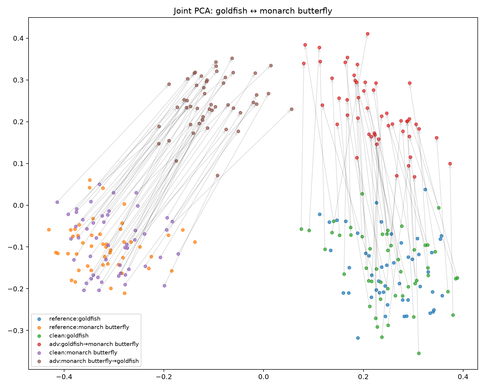
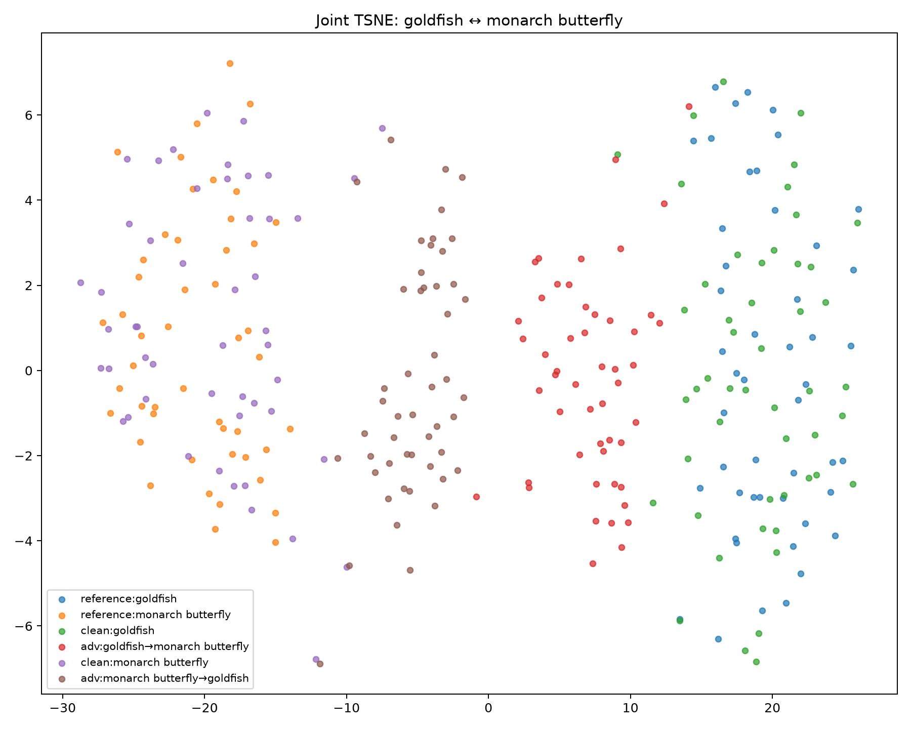
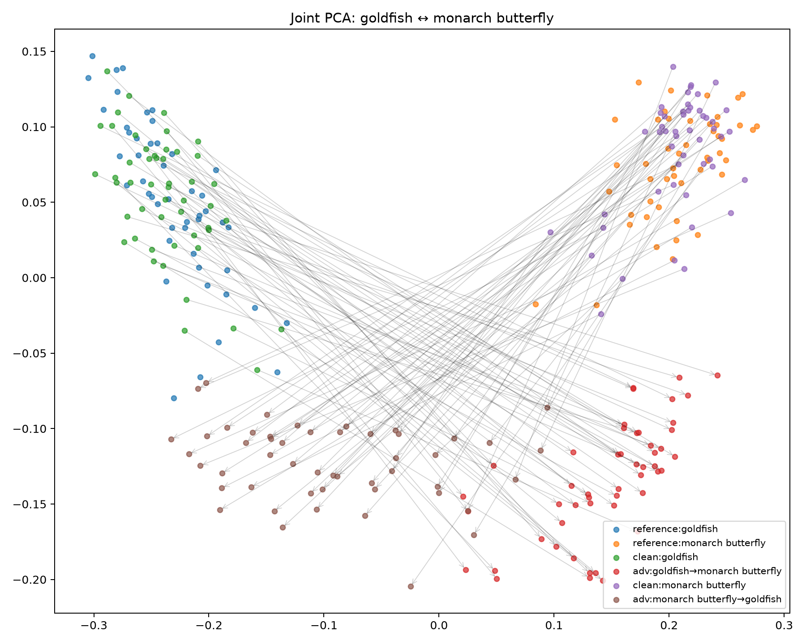
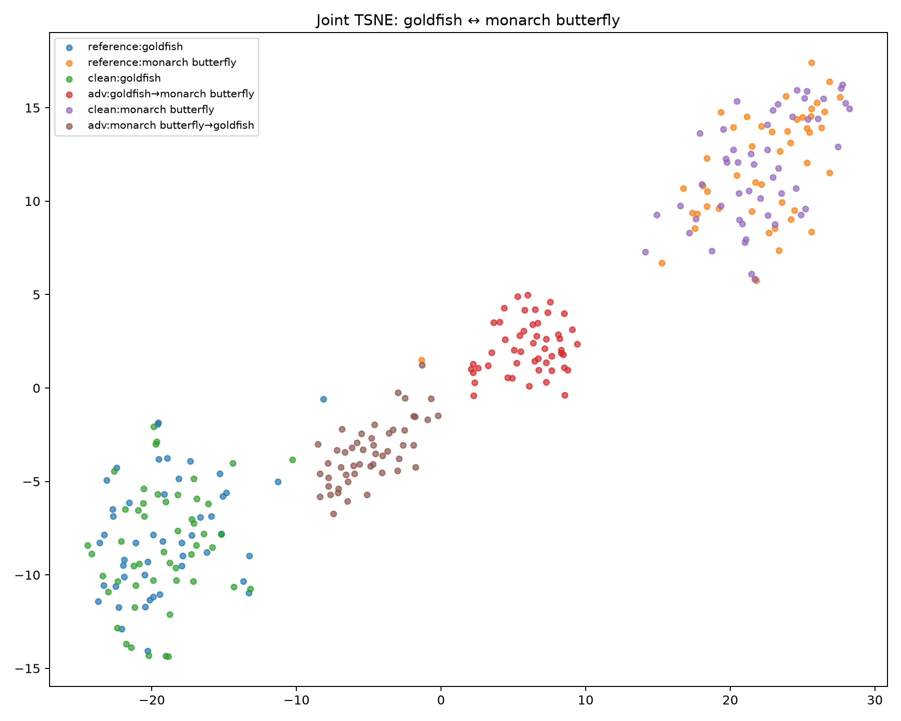
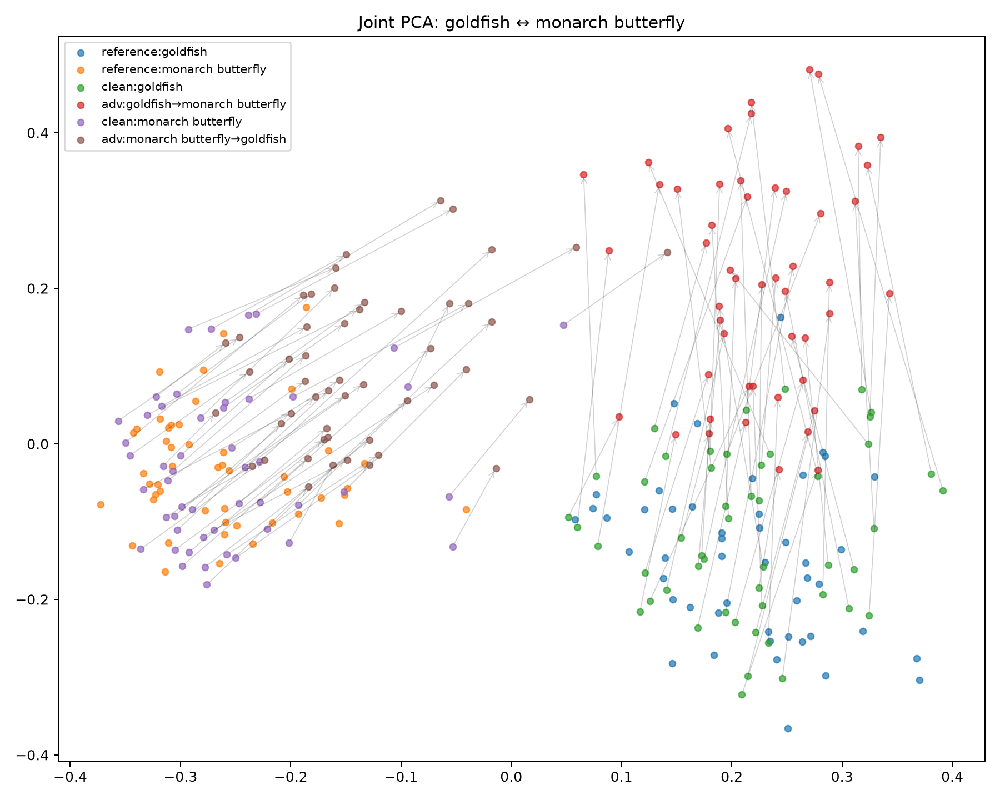
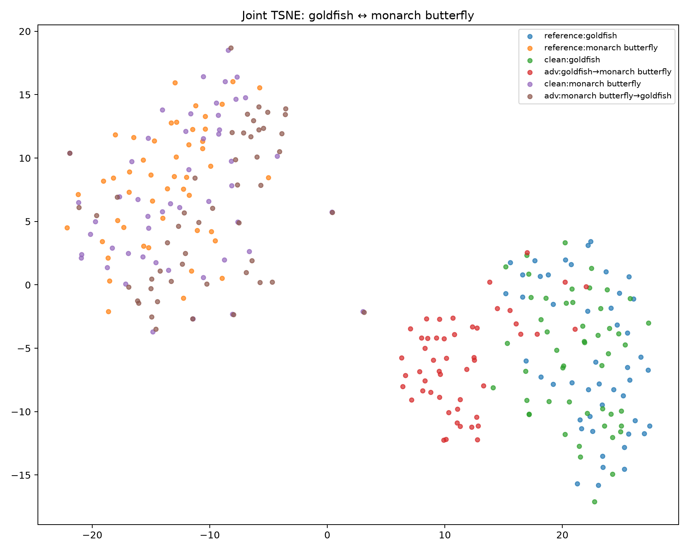
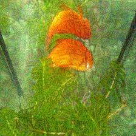
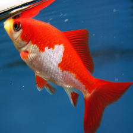
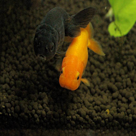
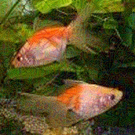

# A100 v5：两组跨家族、一组同家族的定向迁移实验报告

**数据状态：完整。** 本轮主评估覆盖 3 个 proxy→target 组合、90 个有向类别迁移/组合、50 张共同 clean-valid 图片/迁移，共 13,500 个 target 评估样本。P16/P19/P20/P21/P22 的已有数据保留，但不混入此主结果。

## 研究问题与设计

检验基于 proxy 视觉表示的语义 pull/push 攻击能否迁移到 target，并用两个跨家族 pair 与一个同家族 pair 比较。P14 和 P23 共享 **Qwen3.5-2B proxy**，分别指向 Qwen3.5-4B 和 InternVL3.5-4B；这提供了在同一个攻击源下比较同家族与跨家族 target 的机会。P02 提供第二个跨家族模型组合。

10 个 ImageNet diverse 类为 goldfish、monarch butterfly、pineapple、acoustic guitar、laptop、espresso、volcano、rocking chair、soccer ball、school bus。每类 48 张 reference images，另从固定的 64 张 train candidates 里筛出 50 张共同 clean-valid 攻击图；全部 10×9=90 个有向非 self-transition 使用同一 canonical manifest。攻击从预先冻结的 clean 图片生成 PNG，target 仅对已写好的 PNG 评估，没有 target 反馈进入梯度或参数选择。

攻击配置：BF16 proxy、vision encoder mean pooling、以 10-direction pilot 选出的最终视觉层、seed=42、随机起点、epsilon=16/255、50 steps、step size=1/255、momentum=1。分类 loss 权重 `lambda_cls=0`，优化循环跳过 language classification forward。语义 loss 在所有主 cell 固定为

\[L=1.5(1-\cos(z_{adv},\mu_t))+0.5(1+\cos(z_{adv},\mu_s)).\]

主 TASR 以 proxy 已命中目标类的图像为分母，分子是其中 target 也命中的图像；proxy 未命中者不计主分母。PSR 仍以全部 clean-valid 图像为分母，N=50/cell。原 clean-valid 分母的 `unconditional_tasr_percent` 同时保存在 CSV 供复核。条件分母随 cell 变化，聚合率按命中数与分母求和，不能平均各 cell 百分比。

## 主实验：full-90 评估

| Pair | Proxy → target | TASR 全90 | TASR heldout80 | PSR 全90 | ASR 全90 |
|---|---|---:|---:|---:|---:|
| P02 | Qwen3.5-4B → Gemma 4 E4B (cross-family) | 1.23% (50/4060) | 1.19% (43/3617) | 90.22% (4060/4500) | 4.00% (180/4500) |
| P14 | Qwen3.5-2B → Qwen3.5-4B (intra-family) | 56.56% (2014/3561) | 56.39% (1783/3162) | 79.13% (3561/4500) | 50.64% (2279/4500) |
| P23 | Qwen3.5-2B → InternVL3.5-4B (cross-family) | 2.83% (101/3564) | 2.65% (84/3164) | 79.20% (3564/4500) | 6.00% (270/4500) |
| Three-pair micro total | — | 19.36% (2165/11185) | 19.21% (1910/9943) | 82.85% (11185/13500) | 20.21% (2729/13500) |

10 个 pilot directions 用于选择层；其余 80 个 directions 没有参与层选择，因此 heldout80 是更合适的泛化检查。三 pair pilot micro TASR = **20.53% (255/1242)**；heldout80 micro TASR = **19.21% (1910/9943)**。各 cell 的 source、target、命中次数、运行设置和双口径指标见随包 CSV。

## 层深实验与方法消融

层深 pilot 覆盖原始 8 个 pair × 10 directions × 50 张图/层（每层 N=4,000）。每个层百分比通过实际 vision block 数映射，具体 block ID 见审计/配置表。

| 视觉层深度 | TASR | PSR | ASR |
|---:|---:|---:|---:|
| 1% | — (0/0) | 0.00% (0/4000) | 0.40% (16/4000) |
| 25% | 8.33% (1/12) | 0.30% (12/4000) | 4.30% (172/4000) |
| 50% | 35.33% (755/2137) | 53.42% (2137/4000) | 28.50% (1140/4000) |
| 75% | 44.67% (1598/3577) | 89.42% (3577/4000) | 47.60% (1904/4000) |
| 100% | 46.97% (1729/3681) | 92.03% (3681/4000) | 46.98% (1879/4000) |

先前按 clean-valid 分母比较原 8-pair pilot，100% 层为 43.625%，75% 为 42.125%，因此固定了 100% 层。按当前 proxy 条件分母重新报告时，当前三 pair 的 50% 层为 29.41% (325/1105)，75% 层为 26.09% (384/1472)，100% 层为 20.53% (255/1242)；**最终层并非这三 pair 的 pilot 最优层**。本轮 full-90 是统一固定最终层的公平比较，不能写成三 pair 各自最优层的结果。该 pilot 本身承担层选择，也不应用作独立验证。

loss 消融使用本轮相同的 P02/P14/P23、10 个 pilot directions、每 arm 1,500 张，攻击预算相同：

| Loss | TASR | ASR |
|---|---:|---:|
| Pull only | 24.51% (175/714) | 17.80% (267/1500) |
| Push only | — (0/0) | 12.67% (190/1500) |
| Pull + push | 29.44% (325/1104) | 29.27% (439/1500) |

这些是样本加权的描述性比例。50 张图共享同一类别迁移和模型，不能把它们当成彼此独立的 50 次实验；后续显著性评估应按 transition 或类别聚类。

## 表示空间距离、降维与方向不对称

每个 target encoder 对 10 类 references、clean 和 adversarial PNG 抽取同一空间的表示，L2 归一化后计算目标/源 prototype cosine、类别离散度、协方差 trace、effective rank、CKA、RSA、clean margin、margin change 和 gap closure。`mean_delta_R` 是 target prototype pull 与 source prototype push 的和。下面以 goldfish ↔ monarch butterfly 为例，展示两个方向的原空间指标；同一 pair 内 prototype distance 对调 source/target 后不变。

| Pair | Direction | TASR | ΔR | Clean target margin | Source variance | Target variance | Prototype distance |
|---|---|---:|---:|---:|---:|---:|---:|
| P02 | T01 (1→2) | 8.0% | +0.0538 | -0.1836 | 0.1427 | 0.1126 | 0.2210 |
| P02 | T02 (2→1) | 0.0% | +0.1119 | -0.1833 | 0.1126 | 0.1427 | 0.2210 |
| P14 | T01 (1→2) | 96.0% | +0.1672 | -0.1023 | 0.0324 | 0.0248 | 0.1041 |
| P14 | T02 (2→1) | 58.0% | +0.1401 | -0.1011 | 0.0248 | 0.0324 | 0.1041 |
| P23 | T01 (1→2) | 22.0% | +0.0457 | -0.1262 | 0.0933 | 0.0601 | 0.1437 |
| P23 | T02 (2→1) | 0.0% | +0.0482 | -0.1300 | 0.0601 | 0.0933 | 0.1437 |

Joint PCA/t-SNE 对每个 target 模型的 **45 个无序类别对**分别制作一套图：每套图把这两个类的 references 与**两个方向**的 clean/adv 图片拼接后只 fit 一次。PCA 上标出 clean→adv 位移；t-SNE 仅作定性局部结构图。不同模型或不同类别对的图各有自己的降维坐标系，坐标距离不可跨图直接比较；下表的定量距离、方差、margin 都来自原始 embedding 空间。此处展示 goldfish ↔ monarch butterfly 的代表图，全部 270 张 PCA/t-SNE 图在归档 `results/analysis/` 中。

| Pair | Joint PCA | Joint t-SNE |
|---|---|---|
| P02 |  |  |
| P14 |  |  |
| P23 |  |  |

每个 pair 的无序类别对里，TASR 双向差最大的三个如下。Δvariance 是 source 类减 target 类参考云的 cosine dispersion，Δclean margin 是两个方向的初始 target margin 之差。Prototype distance 对两个方向完全相同，因此单靠它无法解释 TASR 方向差；方差、初始 margin、实际表示位移与决策边界共同值得检查。这里的关联不构成因果证明。

| Pair | A→B | TASR A→B | TASR B→A | Δ TASR | Δ variance | Δ clean margin |
|---|---|---:|---:|---:|---:|---:|
| P02 | 6→7 | 14.0% | 2.1% | +11.9 pp | -0.0132 | -0.0111 |
| P02 | 1→2 | 8.0% | 0.0% | +8.0 pp | +0.0301 | -0.0003 |
| P02 | 1→7 | 8.0% | 16.0% | -8.0 pp | -0.0269 | -0.0109 |
| P14 | 2→7 | 18.0% | 98.0% | -80.0 pp | -0.0263 | -0.0026 |
| P14 | 2→6 | 5.3% | 84.6% | -79.4 pp | -0.0199 | -0.0001 |
| P14 | 7→8 | 100.0% | 21.7% | +78.3 pp | +0.0008 | +0.0032 |
| P23 | 1→2 | 22.0% | 0.0% | +22.0 pp | +0.0332 | +0.0038 |
| P23 | 2→8 | 0.0% | 16.7% | -16.7 pp | -0.0515 | -0.0170 |
| P23 | 2→7 | 0.0% | 16.0% | -16.0 pp | -0.0654 | -0.0057 |

以下 Spearman ρ 在每个 pair 的 90 个 directed transitions 上计算，衡量 TASR 与原空间几何统计的单调关联。类别方向存在配对与共享图像，因此这些 ρ 是探索性结果。

| Pair | CKA | RSA | Source var | Target var | ΔR | Clean margin | Gap closure |
|---|---:|---:|---:|---:|---:|---:|---:|
| P02 | -0.10 | -0.20 | +0.13 | -0.20 | -0.03 | +0.17 | -0.03 |
| P14 | -0.09 | -0.08 | +0.31 | -0.13 | +0.51 | -0.04 | +0.51 |
| P23 | -0.13 | -0.11 | +0.27 | -0.10 | +0.11 | +0.03 | +0.11 |

完整 `correlation_matrix.csv`/热图、class variance、per-image representation shift 与 asymmetry CSV 均在归档内。t-SNE 二维欧氏距离没有用于相关性或机制结论。

## 真实攻击图片示例

下列 T01（goldfish→monarch butterfly）图片全部取自实验保存的 PNG。每个 pair 展示一组目标命中和一组未命中；`examples.csv` 保存目标模型的 clean/adv 解析标签。所有展示样例的 clean→adv 最大像素变化为 16/255。

| Pair | Target outcome | Clean PNG | Adversarial PNG |
|---|---|---|---|
| P02 | hit |  |  |
| P02 | miss |  |  |
| P14 | hit |  |  |
| P14 | miss |  |  |
| P23 | hit |  |  |
| P23 | miss |  |  |

## 可复现文件与限制

结果包包含 main full-90、pilot10、heldout80 三张主表、5 层 pilot、3 组 ablation、每个 pair 的 full-90 geometry 和相关矩阵、canonical manifests、clean screen、模型/层审计、YAML 配置、运行和分析脚本、环境/model revision 元数据，以及真实 PNG 样例。模型权重和 ImageNet 原始图像不在压缩包内；manifest 记录数据选择，PNG 示例可直接查看。

本轮选择 P14/P23 共享 proxy，有助于比较 target family；P02 的 proxy 规模不同，因此跨两个跨家族 pair 直接归因于 family 时要考虑 proxy 差异。主 TASR 使用 proxy-success 条件分母，可能因为 proxy 失败样本被排除而高于全 clean-valid 率；两种口径均在 CSV 中。若之后补做 P16/P19/P20/P21/P22，应沿用当前 manifest、攻击预算和指标定义。

已完成的全部 8-pair × 5-layer pilot 与三组消融另有一份综合解释：`completed_data_analysis/all_completed_analysis.md`。它包含 pair 级图表、CKA/表示位移与迁移率的关系，以及 pilot 方差对不对称性解释的检验；其中未完成的 full-90 cell 明确排除在结论之外。
